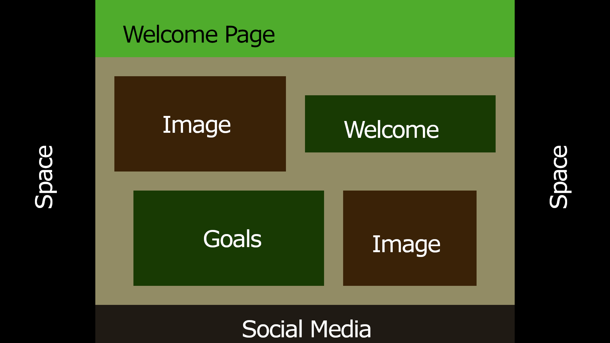
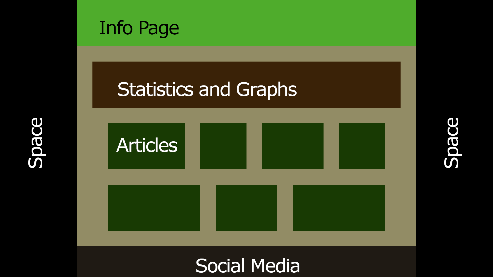
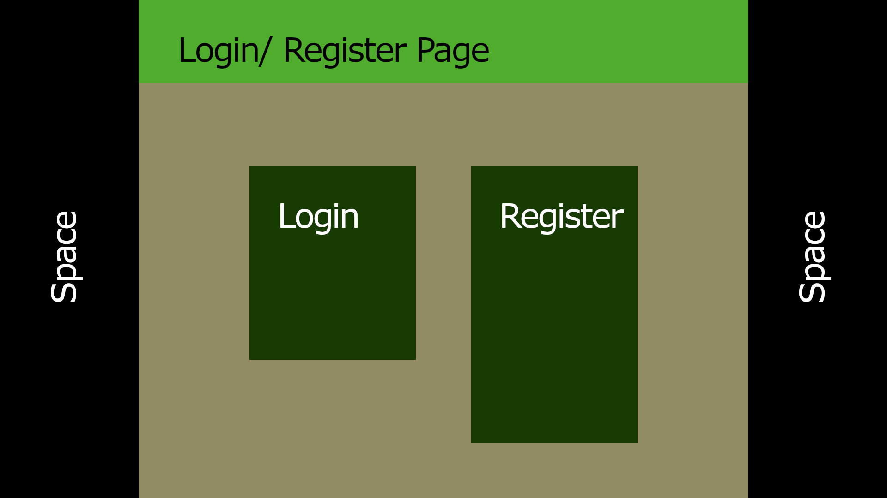
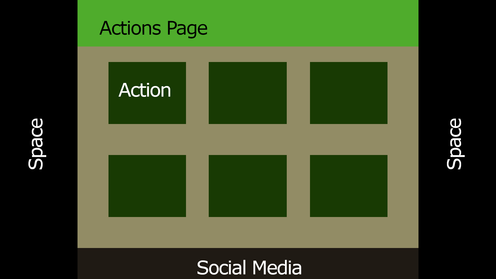

# Blueprints

This is a preview of what AnimaLand could look like.

> Note that colors are just used for section distinction. Final color palettes will be formed later. For now focus on generic layout.

## Welcome Page

- _Space_ represents the fixed spacing for actual content.
- _Quote of the Day_ is not included. It could be placed right after the banner/ header.

## Info Page

- _Statistics and Graphs_ may provide statistical information about AnimaLand (how many users are using this web app, how many open issues exist...) or about environment in general (amount of species under extinction, air pollution representations...).
- _Articles_ may be image-links to actual article pages.

## Login/ Register Page

- This page may be the simplest one. No footer is needed.
- An additional motivational quote-pun could be used at the top of the page (something like _SaveIn_ or _ProtectIn_ instead of _LogIn_).

## Actions page

- A grid-like list of individual _Actions_ could be placed in that page.
