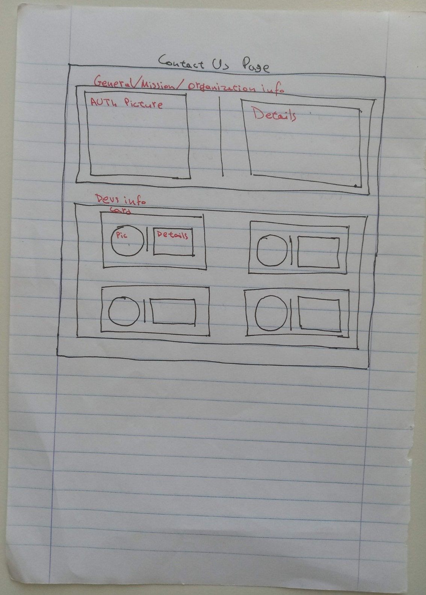

# Blueprint of Contact Us Page

There will be two main sections:
- _general_ info
- _dev-related_ info

## General Info

This section may contain information about our "organization", our goals, our mission and our action. It can also provide a set of links to the social media of our organization. Location, telephone number and other details may or may not be omitted.

In this section we could possibly add a nice picture of AUTh.

## Dev-related Info

This section may contain four cards that provide information about us (the devs).

Each card may be composed of those elements:
- Profile picture (round-crop)
- Our name
- Our role in the project (e.g. "Designer")
- A quote related with the environment (e.g. "I want to save my children's world")
- A link to our personal site
- Our e-mail
- A brief paragraph about us.
