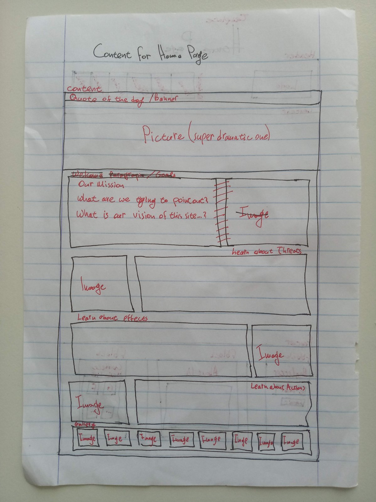

# Blueprint of Home Page

There will be three main elements:
- A _dramatic picture_ with the _quote of the day_
- The _welcome paragraph_ with the _link section_
- The _gallery_

> Note that this model does NOT include the "News" section. See below for more details.

## Picture + Quote

This may include a full-width, HD banner with a quote chosen from a pool of quotes.

Quotes should be dynamically updated every other minute or so (and maybe the banner too).

The banner may be transparent-like (see iceless.info for more details).

## Welcome Paragraph and Link

Both of those sub-elements will look alike.

The _welcome paragraph_ may greet the visitors and briefly present the goal of this web-app.

The _link section_ may introduce the visitor to the other pages of this web-app, directing them there.

## Gallery

This section may be a typical carousel of elegant pictures.

---

## News

### Why not to include

- **Semantically off:** Our web-app may not be the right place to get the latest news about environment. We should focus on more _static_ information.
- **Design/ coding complexity:** The uploaded news-articles must be re-designed with every entry. Also, there should probably be an extra main page grouping all existing articles.

### ...but I insist, we need it!

Ok, I guess we could replace the _gallery_ section with the _news_ section then.

We can keep the carousel model, where every card points to an article (external or internal to our web-app).

In order to somehow keep the _gallery section_ without overloading the _Home page_, we may add a simple gallery to every other informative page.
