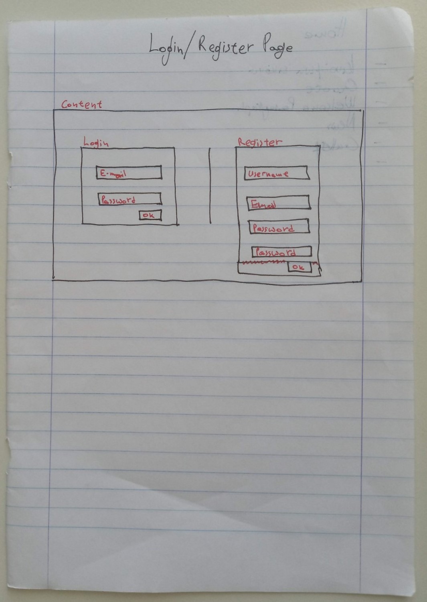

# Blueprint of Login/ Register Page

It is not explicitly mentioned, but this page may not require the typical footer. For completeness, we could include it though.

In the case where any error occurs, this page may result in the creation of a modal window.

Additionally this page could display a simple yet smart quote that motivates user to register or take action.

There will be two elements:
- The _login_ form
- The _register_ form

## Login

This form will wait for user's information to let him/ her access the personalized content.

The form will include the following elements:
- Username or e-mail input
- Password input
- Submit button

## Register

This form will wait for user's information to let him/ her create a brand new account.

The form will include the following elements:
- Username input
- E-mail input
- Password input
- Password input (validation)
- Submit button
