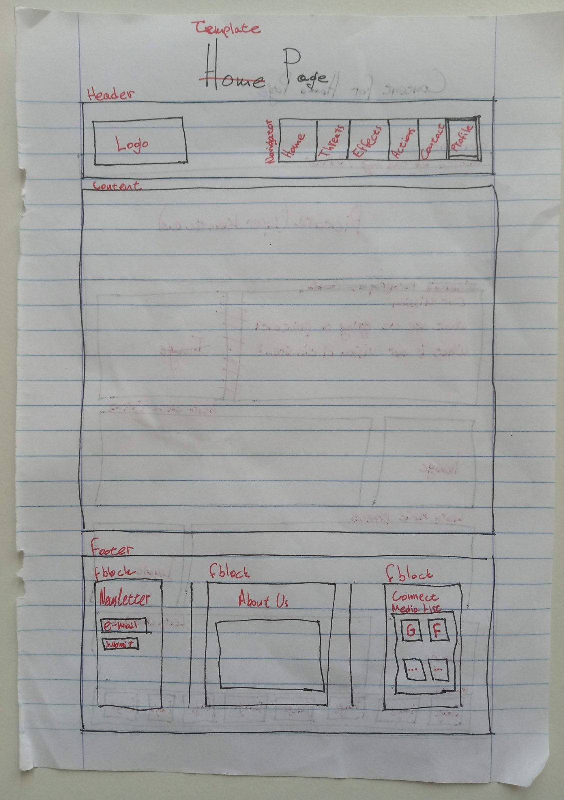

# Blueprint of Template

There will be three main elements, common in every page:

- The _header_
- The actual _content_
- The _footer_

## Header

The _header_ should contain our _logo_ and the _navigation menu_. It should be stuck at the very top of the page (not floating on top).

## Content

This element may be specified on individual files.

## Footer

The _footer_ should be as minimal as possible, including those f-blocks (footer blocks):

- Newsletter
- About Us
- Connect
